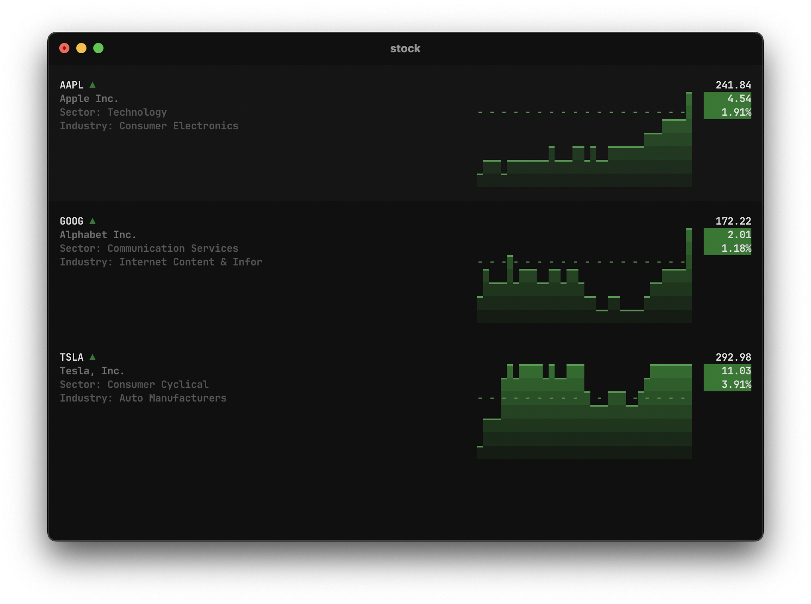

# stocks-term
A modern TUI for displaying stocks, written in python 🐍
</img>
The modern way to access stocks from the terminal.
## Capabilites
- Portfolio and custom watchlists
- List views for multiples stocks
- Graph views for any stock
- Heatmaps from lists of stocks
